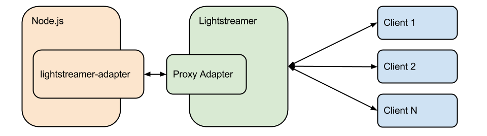

# Lightstreamer SDK for Node Adapters 1.5.1 #

This package includes the resources needed to write Data Adapters and Metadata Adapters for [Lightstreamer](http://www.lightstreamer.com/ "Lightstreamer") Server in a [Node.js](http://nodejs.org/ "Node.js") environment.
The adapters will run in a separate process, communicating with the Server through the Adapter Remoting Infrastructure.



## Use ##
Install the package using npm
```
npm install lightstreamer-adapter
```

### Configure Lightstreamer ###
1. Download and install Lightstreamer
2. Go to the "adapters" folder of your Lightstreamer Server installation. Create a new folder to deploy the remote adapters in, let's call it "NodeAdapter".
3. Create an "adapters.xml" file inside the "NodeAdapter" folder and use the following contents (this is an example configuration, you can modify it to your liking by using the generic template, `DOCS-SDKs/adapter_remoting_infrastructure/doc/adapter_conf_template/adapters.xml` or `DOCS-SDKs/adapter_remoting_infrastructure/doc/adapter_robust_conf_template/adapters.xml`, as a reference):
    ```xml
    <?xml version="1.0"?>
    <adapters_conf id="PROXY_NODE">
            <metadata_provider>
                    <adapter_class>ROBUST_PROXY_FOR_REMOTE_ADAPTER</adapter_class>
                    <classloader>log-enabled</classloader>
                    <param name="request_reply_port">8003</param>
                    <param name="timeout">36000000</param>
            </metadata_provider>
            <data_provider>
                    <adapter_class>ROBUST_PROXY_FOR_REMOTE_ADAPTER</adapter_class>
                    <classloader>log-enabled</classloader>
                    <param name="request_reply_port">8001</param>
                    <param name="notify_port">8002</param>
                    <param name="timeout">36000000</param>
            </data_provider>
    </adapters_conf>
    ```

4. Take note of the ports configured in the adapters.xml file as those are needed to write the remote part of the adapters.

### Write the Adapters ###
Create a .js file, let's call it "adapters.js"

1. Get the net package and create the connections to Lightstreamer server. Note that the ports are the same used in the above file; LIGHTSTREAMER_SERVER_HOST is the host of the Lightstreamer server e.g.: "localhost".
   ```js
   var net = require('net'),
   reqRespStream = net.createConnection(8001, LIGHTSTREAMER_SERVER_HOST),
   notifyStream = net.createConnection(8002, LIGHTSTREAMER_SERVER_HOST),
   metadataStream = net.createConnection(8003, LIGHTSTREAMER_SERVER_HOST);
   ```

2. Get the adapter classes and create the needed instances
   ```js
   var MetadataProvider = require('lightstreamer-adapter').MetadataProvider,
   DataProvider = require('lightstreamer-adapter').DataProvider,
   dataProvider = new DataProvider(reqRespStream, notifyStream),
   metadataProvider = new MetadataProvider(metadataStream);
   ```

3. Now you can register the events to respond to the adapters duties; see the documentation for the details
   ```js
   dataProvider.on('subscribe', function(itemName, response) {
       //HERE start sending updates for the itemName item
       response.success();
   });
   dataProvider.on('unsubscribe', function(itemName, response) {
       //HERE stop sending updates for the itemName item
       response.success();
   });
   metadataProvider.on('notifyUserMessage', function(request, response) {
       //HERE handle user message
       response.success();
   });
   ```

4. Send updates for an item. Note that sending updates for items no one has subscribed to will result in an error,
hence this calls must be bound to the "start/stop sending updates" comments int he subscribe/unsubscribe events:

   ```js
   dataProvider.update(itemName, false, {
       'field1': valField1,
       'field2': valField2
   });
   ```

### Run ###
From the command line call
```
node adapters.js
```

### Connect a Client ###
```js
var lsClient = new LightstreamerClient(LIGHTSTREAMER_SERVER_HOST,"PROXY_NODE");
lsClient.connect();
```

Note that the "PROXY_NODE" string is taken from the adapters.xml

### API Reference ###
http://www.lightstreamer.com/api/ls-nodejs-adapter/1.5.1/

## Develop ##
This section is dedicated to developers who want to extend/modify the library itself, if you're simply looking to use it, ignore it.

### Linking ###
We want to write code to use our package by requiring "lightstreamer-adapter" without having to specify the full path.
On the other hand, during development, we do not want to install the package from the repo as we want to, in fact, test it before putting it on the repo for everyone else to enjoy.
So:

1. Go to the root of this project
2. Call
   ```
   npm link
   ```
3. Go to the project where you need to use the development version of the package
4. Call
   ```
   npm link lightstreamer-adapter
   ```

NOTE: You can't globally link the package (using -g) to make it available everywhere

### Testing ###
First install nodeunit
```
npm -g install nodeunit
```

The -g unit will install it on the system instead of installing it locally; you may remove it if you prefer a local installation

Go to the test folder and run the following commands
```
nodeunit dataprotocol.test.js
nodeunit dataprovider.test.js
nodeunit metadataprotocol.test.js
nodeunit metadataprovider.test.js
```

### Generate Documentation ###
1. Get [JSDoc 3](https://github.com/jsdoc3/jsdoc "JSDoc 3")
2. Assuming you have the jsdoc folder in your path, go to this project folder and call
   ```
   jsdoc --recurse --destination docs lib
   ```

The API documentation will be available in the docs folder.

## See Also ##
* [Adapter Remoting Infrastructure Network Protocol Specification](https://lightstreamer.com/api/ls-generic-adapter/latest/ARI%20Protocol.pdf "Lightstreamer ARI protocol")
* [Lightstreamer Chat Demo adapter for Node](https://github.com/Lightstreamer/Lightstreamer-example-Chat-adapter-node "Lightstreamer Chat Demo adapter for Node")

## Lightstreamer Compatibility Notes ##
Compatible with Adapter Remoting Infrastructure since 1.8
- For a version of this library compatible with Adapter Remoting Infrastructure version 1.7, please refer to [this tag](https://github.com/Lightstreamer/Lightstreamer-lib-node-adapter/tree/version-1.3.4).
- For a version of this library compatible with Adapter Remoting Infrastructure version 1.4.3, please refer to [this tag](https://github.com/Lightstreamer/Lightstreamer-lib-node-adapter/tree/version-1.0.2).
